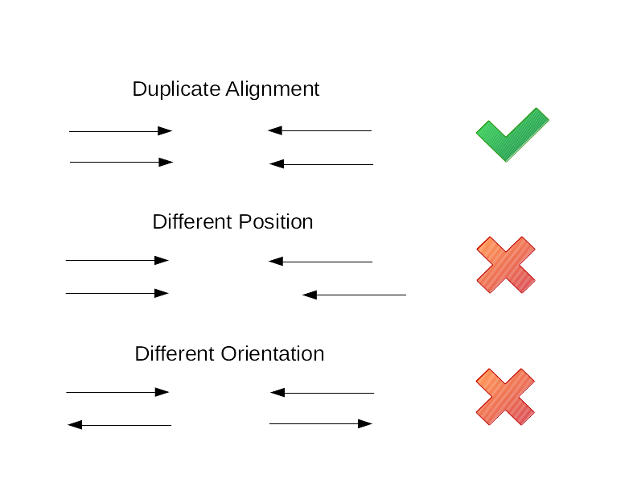
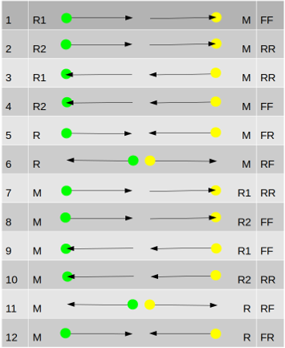
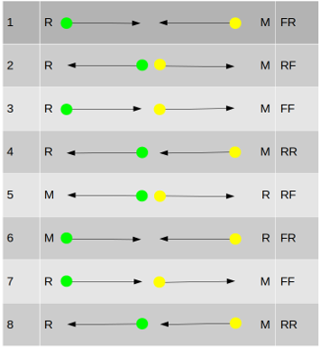

# Duplicate Marking

## Introduction

Duplicate reads lead to an over-representation of sequence data at the location of those reads.  Essentially this is repeatedly using the evidence from the same source molecule and can bias results.  Duplicate marking indicates that the duplicate reads should not be used for analysis.  As an alternative, duplicates can be removed.

Two of the major types of artificial duplication are PCR and optical.  PCR duplication is often caused by the over amplification of the source material; too many copies of a too small sample.  In addition, anything that promotes amplification of only certain areas would also lead to this kind of duplication.  Optical duplication is something seen on certain Illumina sequencers.  Large local clusters on the flow cells (or a reclustering) can lead to single molecules being counted more than once.  Typically these are close together.

Duplicate marking is not always useful.  For example, some amplicon based approaches mean that sequencing starts at the same sites which would mistakenly look like duplication.  

## The Basics

Barring sequencing errors, duplicate reads will be identical but comparing every read against every other read to find them would be computationally expensive so we use another method.  As the reads are identical, once aligned they will be in the same place in a coordinate sorted SAM file.  Using the alignment data for each read (and its mate for paired reads) we take the position and orientation (which strand it aligns against and in what direction) to compare the reads against one another.  If two (or more) reads have the same values then the one with the highest base qualities is held to be the original and the others are the duplicates.

It should be noted that samtools markdup looks for duplication first and then classifies the type of duplication afterwards.  If your process does not care whether duplication is PCR or optical then markdup is faster if you do not use the optical duplicate option.

Duplicates are marked by setting the alignment's DUP flag.

 

## The Details

The duplication checks only apply to primary alignments.  Supplementary and secondary alignments are not used though they can be marked as duplicates if their primary alignments are.

### Base Criteria
These are the criteria samtools markdup uses to identify duplicate reads.  For read pairs:

* Read reference and position
* Mate reference and position
* Leftmost
* Pair orientation

Single reads (ones without a matching pair) use reference, position and orientation.

Position and mate position are the unclipped position of the read against the reference.  Which end of the read the position is taken from depends upon the orientation of the pair.  Orientation depends on the strands that the reads are mapped to, there are more details in its own section below.  Leftmost is a true or false indicator of whether the read has the lowest aligned reference/position of the pair.

### Optional Criteria
There are two more options for duplicate checking, UMI (barcodes) and read groups.  Both options add further tests to the base criteria.  If reads that would have previously been labelled as duplicate have different barcodes or read groups then they are no longer counted as duplicates.

**UMI/Barcodes**

This adds barcodes to the checks for duplication.  Either using the field at the end of the read name (QNAME), an auxiliary tag (RX or any other of your choosing) or using a regular expression to extract the barcode from the read name. 

**Read Groups**

This uses the read group from the RG auxiliary tag in the duplicate tests. 

### Originality
Once two sets of reads have been tested as identical then we need to choose one as the duplicate and one, for want of a better term, as the original.  We do this by adding up the base quality scores of the reads and their pair mates (if they have them) and declare the lowest scoring one as the duplicate.

There are a couple of exceptions to this process.  If a single read is matched with one of a read pair then the single one is always marked as the duplicate.  If a read that is marked as a QC fail is matched against a read that is not, then the QC failed read is marked as the duplicate.  Including QC failed reads in duplicate marking is optional and not on by default. 

### Optical Duplicates
For detecting optical duplicates that have been sequenced on HiSeq, NovaSeq or other similar technologies we use a distance (`-d`) setting.  Once a read has been tested as a duplicate then its x/y coordinates (along with other data in the rest of the read name e.g.  lane and tile numbers) are compared to the distance number.  If the coordinates are within that distance then the read is marked as an optical duplicate by adding the dt:Z:SQ tag, otherwise it is dt:Z:LB.

The x/y coordinates are taken from the read names.  For names not using the Illumina standard then there is an option to use a regular expression to get the numbers.

The suggested optical distance for HiSeq is 100 and 2500 for NovaSeq.  These numbers may not be the best ones for all instances and some experimentation may be required to get better results.

### Duplicate Chains
As samtools markdup works on a single pass through the data, it is possible to get duplicates of duplicates.  It happens when a read that was marked as an original is later marked as a duplicate itself.  In terms of the number of duplicates and which one is taken as the original it makes no difference, but if you want to mark duplicates of optical duplicates as optical duplicates then that is where duplicate chains come in.

The program maintains a list of related duplicates and just before the reads are written out there is a final pass through the list to make sure all optical duplicates are marked appropriately.

As it is a relatively expensive process that can slow samtools markdup down (or you may not agree with the entire premise of duplicates of duplicates), there is an option (`--no-multi-dup`) to turn this behaviour off.

The duplicate chain is also used when tagging duplicates with the original read.  The `-t` option will add an do:Z:read_name tag to the duplicate to show which read it is a duplicate of.  This option is intended for debugging and monitoring the behaviour of samtools markdup.

### Orientation
Orientation can be FR (reads on opposite strands and pointing towards each other),  RF (reads on opposite strands and pointing away from one another), FF (both reads on the forward strand pointing in the same direction) and RR (as FF but on the reverse).
Orientations of single reads are simply forward or reverse.  These orientations are more a label than a real description of how the read was sequenced.

There are two modes samtools markdup can use to set the orientation and decide the coordinate positions. The default is template (`-m t`) which is based on template starts and ends.  The other is sequence (`-m s`) which is based on the start and end of the read.  Both modes will produce largely the same results but with some differences, especially in messier alignments.

The tables below show how markdup interprets the read information.  R (or R1/R2) is the read being looked at.  M is the mate of that read (using data in the alignment).  The green spot is where the leftmost (nearest the beginning) coordinate and yellow the rightmost (nearest the end) with regards to the reference.

**Template**

This is the more complex of the two.  While both modes treat the FR (and RF) orientations identically, template mode takes into account whether it is looking at the first (R1) or last (R2) read in the template (as defined in the SAMtools flags).  This can lead to it being a bit more selective than sequence mode in deciding what is a duplicate.

**Sequence**

This is the more straightforward of the two modes.  Coordinates are taken from the 5' ends of the reads and no distinction is made between first and second in the template.

## Other Options
These are options to be aware of.

`-l` sets the the longest expected length of the reads (default 300 base pairs).  If the reads are longer than this length then some duplicates can be missed.

`-c` clears any previous duplicate marking (duplicate flag (DUP) and tags).  This does not get done by default and any existing markings will be ignored which could lead to the end file being a combination of multiple duplicate marking runs.

`--include-fails` lets reads that have the quality failed flag (QCFAIL) set be included in the duplicate marking.  This can increase the number of duplicates found.

`-S` mark secondary or supplementary alignments of duplicate reads as duplicates.  Also works on unmapped mates of duplicate reads.  As this takes a quick second pass over the data it will increase running time.

## Workflow
This is a simple workflow for duplicate marking.

1. `samtools collate -o namecollate.bam example.bam`
2. `samtools fixmate -m namecollate.bam fixmate.bam`
3. `samtools sort -o positionsort.bam fixmate.bam`
4. `samtools markdup positionsort.bam markdup.bam`

Step (1) groups the reads by read name in the bam file.  This puts the read pairs close together so that fixmate can work.  Step (2) repairs mate information for read pairs.  For markdup the most important parts are the MC and ms tags.  MC adds the mate cigar string and is used to calculate the mate position for duplicate matching.  The ms tag is the mate quality score and is used to calculate originality. Step (3) sorts the reads into position order to make it reads for markdup.  Step (4) is the duplicate marking.  The main part of finding duplicates is done in a single pass through the bam file.  Because the duplicates and originals have to be aligned to the same position it is only necessary to look at a small portion of the file at once.  This forms a moving window, reads in the window are held in memory.  Once the window has moved past the point where there are possible duplicates then the processed reads are written out.  This keeps the memory use smaller than it otherwise would be.

To avoid intermediate files the samtools commands can be piped together.

`samtools collate -@ 4 -O -u example.bam | samtools fixmate -@ 4 -m -u - - | samtools sort -@ 4 -u - | samtools markdup -@ 4 - markdup.bam`

The -u option produces uncompressed output.  Since the output is not being written to disk then size is unimportant and avoiding compress/decompress reduces the amount of work that needs doing.  The `-@` option turns on threading which can speed things up.

This is the simplest example of markdup use and there are options to fine tune it to produce the results that you want.  For example, if you wanted to output results that are similar to Picard’s MarkDuplicates for optical duplicates then the command would be this:

`samtools markdup -@ 4 -f stats_file.txt -S -d 2500 --mode s --include-fails positionsort.bam markdup.bam`

The `-f` option writes out some statistics to a file.
