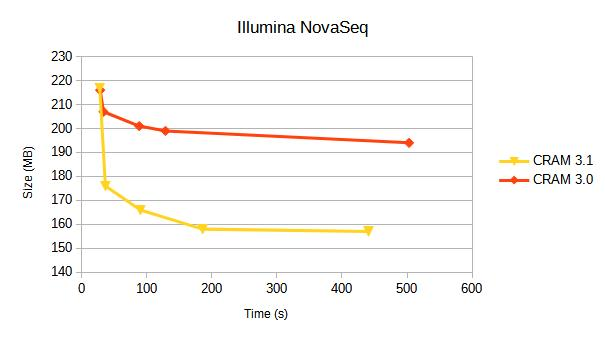
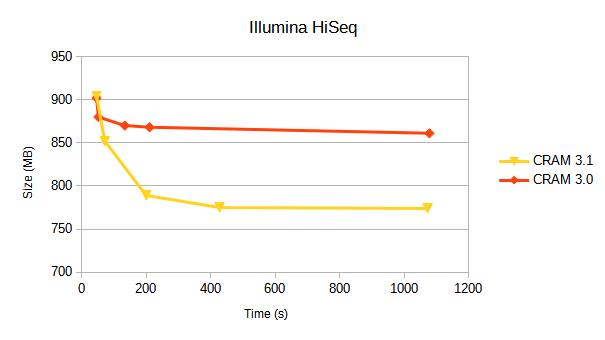
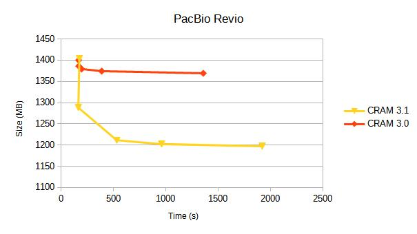
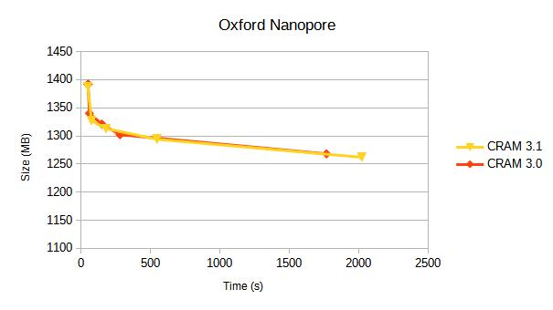

CRAM 3.1 becomes the default CRAM output version
================================================

Release 1.22 of HTSlib and SAMtools has switched to writing CRAM 3.1
by default.  Read support CRAM 3.1 has been available since HTSlib
1.12 (March 2021), and we announced our switch to making it the
default in September 2024.

Support for CRAM 3.1 exists in other tools, including the Noodles
(Rust) and at the time of writing a GitHub pull-request exists for
adding it to HTSJDK.

If you need to continue using CRAM 3.0, please explicitly specify the
version when using SAMtools.  For example:

    samtools view -O cram,version=3.0 file.bam -o file.cram

This is also the way you can control the compression levels and/or
profiles.  E.g.

    samtools view -O cram,small,level=7 file.bam -o file.cram

Note not all machine types may benefit from CRAM 3.1, as it largely
depends on the randomness of the data.  However some platforms may
benefit considerably.  As with CRAM 3.0 there is a tradeoff between
speed and size, but CRAM 3.1 adds more sequence data specific
compression codecs which make this tradeoff more worth while.  The
default output however favours the faster end of the speed/size
tradeoff.  There is a paper describing these codecs at
https://doi.org/10.1093/bioinformatics/btac010.

CRAM 3.0 vs 3.1 benchmark summary
=================================

We compare CRAM 3.0 against CRAM 3.1 for a variety of sequencing platforms.
Each line represents a different compression profile, targetting
different positions on the speed-vs-size tradeoff.

Details of these compression profiles and specific tables of data are
below.  Some earlier benchmarks from 2019 are [also available](CRAM-2019.md).

CRAM benchmarking profiles
==========================

(Updated Apr 2025)

<!-- Tested on seq22-os0000001, Intel Xeon Processor (Skylake)

R/W:  perf stat ./test/test_view -@8 -C -o opt... in.bam -p out.cram
READ: perf stat ./test/test_view -@8 -B out.cram
-->

These benchmarks here are for a variety of instrument types and showing
differences between BAM and various CRAM versions.  Each format also
permits a variety of compression options and levels.  For speed, we
test only a subset of the full data sets.  Note that this may have an
impact on expected compression ratios if the data set contains a large
amount of unaligned data at the end or if the chosen subset is not
representative of the overall data.

The benchmarks below utilise the HTSlib supported compression profiles
of "fast", "normal" (the default), "small" and "archive".  These set a mix of
options as defined here:

{:.table}
Profile  | CRAM versions | options
-------- | ------------- | -------
fast     | 3.0           | seqs_per_slice=10000,level=1
fast     | 3.0, 3.1      | seqs_per_slice=10000,level=1,use_tok=0
normal   | 3.0, 3.1      | seqs_per_slice=10000
small    | 3.0           | seqs_per_slice=25000,level=6,use_bzip2
small    | 3.1           | seqs_per_slice=25000,level=6,use_bzip2,use_fqz
archive  | 3.0           | seqs_per_slice=100000,level=7,use_bzip2
archive  | 3.1           | seqs_per_slice=100000,level=7,use_bzip2,use_fqz,use_arith

If level 8 was specified prior to enabling "archive" mode, then it
also adds "use_lzma" into the option list.  We also provide benchmarks
of using lzma to show the maximum compression, but it is rarely worth
the CPU cost.

Illumina NovaSeq
----------------

10 million coordinate sorted alignments, originating from an Illumina
published dataset when announcing the NovaSeq.

{:.table}
Format       | Options          |     Size(Mb) | Encoding(s) real | Encoding(s) CPU | Decoding(s) real | Decoding(s) CPU
------------ | ---------------- | ---------: | ----- | -----: | --: | ---:
BAM          | level=1          |        577 |   5.6 |   18.3 | 0.8 |  4.4
BAM          |                  |        515 |   9.2 |   61.7 | 0.8 |  4.2
BAM          | level=7          |        508 |  15.0 |  109.9 | 0.9 |  4.3
BAM          | level=9          |        481 | 209.9 | 1661.0 | 0.9 |  4.3
------------ | ---------------- | ---------: | ----: | -----: | --: | ---:
CRAM v3.0    | fast             |        216 |   5.2 |   28.3 | 2.0 | 13.6
CRAM v3.0    |                  |        207 |   5.4 |   33.4 | 2.1 | 13.8
CRAM v3.0    | small            |        201 |  11.6 |   88.3 | 3.2 | 24.4
CRAM v3.0    | archive          |        199 |  17.4 |  128.7 | 3,5 | 25.9
CRAM v3.0    | archive,use_lzma |        194 |  65.4 |  503.2 | 2.6 | 18.6
------------ | ---------------- | ---------: | ----: | -----: | --: | ---:
CRAM v3.1    | fast             |        217 |   4.6 |   27.6 | 1.9 | 10.9
CRAM v3.1    |                  |        176 |   5.4 |   36.4 | 1.9 | 11.6
CRAM v3.1    | small            |        166 |  11.8 |   90.1 | 5.5 | 41.5
CRAM v3.1    | archive          |        158 |  24.3 |  185.8 | 5.8 | 42.4
CRAM v3.1    | archive,use_lzma |        157 |  57.2 |  440.9 | 6.0 | 43.4

A break down of data types in CRAM 3.1 is:

{:.table}
Data type    | File percentage | Bits per base
------------ | --------------- | -------------
Quality      | 50%	       | 0.46
Sequence     | 23%	       | 0.22
Read names   | 18%	       | 0.17
Aux tags     |  9%	       | 0.08

The quantisation of quality values shows a significant reduction in
the amount of storage taken by quality values compared to the earlier
HiSeq (below).

Illumina HiSeq 2500
-------------------

10 million alignments from https://ftp-trace.ncbi.nlm.nih.gov/giab/ftp/data/AshkenazimTrio/HG002_NA24385_son/NIST_Illumina_2x250bps

Aligned and coordinate sorted.

{:.table}
Format     | Options          |     Size(Mb) | Encoding(s) real | Encoding(s) CPU | Decoding(s) real | Decoding(s) CPU
---------- | ---------------- | -----------: | ----: | -----: | ---: | ----:
BAM        | level=1          |         1671 |  12.6 |   43.7 |  1.8 |  10.4
BAM        |                  |         1546 |  19.2 |  125.2 |  1.7 |   9.9
BAM        | level=7          |         1536 |  28.9 |  204.4 |  1.7 |   9.9
BAM        | level=9          |         1461 | 251.4 | 1992.1 |  1.8 |   9.9
---------- | ---------------- | -----------: | ----: | -----: | ---: | ----:
CRAM v3.0  | fast             |          902 |   7.7 |   45.9 |  3.1 |  21.2
CRAM v3.0  |                  |          880 |   8.1 |   51.6 |  3.0 |  21.5
CRAM v3.0  | small            |          870 |  17.8 |  133.6 |  4.3 |  31.4
CRAM v3.0  | archive          |          868 |  28.1 |  210.4 |  4.5 |  32.6
CRAM v3.0  | archive,use_lzma |          861 | 137.7 | 1078.5 |  3.9 |  27.3
---------- | ---------------- | -----------: | ----: | -----: | ---: | ----:
CRAM v3.1  | fast             |          904 |   7.7 |   46.0 |  2.9 |  15.2
CRAM v3.1  |                  |          852 |  10.1 |   71.4 |  3.1 |  22.2
CRAM v3.1  | small            |          789 |  25.9 |  200.0 | 14.6 | 113.3
CRAM v3.1  | archive          |          775 |  56.4 |  427.7 | 15.7 | 109.4
CRAM v3.1  | archive,use_lzma |          774 | 135.1 | 1073.0 | 15.7 | 109.4

The addition of lzma as a codec choice helps the compression ratio of
CRAM 3.0 a little, but at a big cost in CPU making it likely not worth
it.  It's used even less in CRAM 3.1, costing CPU during encoder
evaluation, but mostly being unutilised for any large data types
thanks to the better range of codecs available.

A break down of data types in CRAM 3.1 (default) is:

{:.table}
Data type    | File percentage | Bits per base
------------ | --------------- | -------------
Quality      | 86%	       | 2.37
Sequence     |  7%	       | 0.18
Read names   |  4%	       | 0.11
Aux tags     |  3%             | 0.08

The bulk of the storage cost is the quality values due to the 32
discrete values.

The QS data series shrinks from 735MB to 665MB when we enable archive
mode, and this accounts for the bulk of the reduction. (Similarly for
small mode which also uses the fqzcomp quality codec.)

PacBio Revio
------------

Alignments from https://s3-us-west-2.amazonaws.com/human-pangenomics/index.html?prefix=T2T/HG002/assemblies/polishing/HG002/v1.0/mapping/hifi_revio_pbmay24/

The reference used for this is the T2T hg002v1.0.1.fasta.gz file.

{:.table}
Format       | Options          |     Size(Mb) | Encoding(s) real | Encoding(s) CPU | Decoding(s) real | Decoding(s) CPU
------------ | ---------------- | ---------: | ---: | ---: | ---: | ---:
BAM          | level=1          |       5347 |   39 |  154 |  6.7 |  46.4
BAM          |                  |       4832 |   66 |  420 |  5.6 |  32.3
BAM          | level=7          |       4785 |  108 |  753 |  6.7 |  35.7
BAM          | level=9          |       4409 | 1219 | 9680 |  6.9 |  36.3
------------ | ---------------- | ---------: | ---: | ---: | ---: | ----:
CRAM v3.0    | fast             |       1400 |   28 |  167 | 12.4 |  80.2
CRAM v3.0    |                  |       1386 |   27 |  168 | 12.1 |  77.3
CRAM v3.0    | small            |       1379 |   29 |  195 | 12.1 |  79.9
CRAM v3.0    | archive          |       1374 |   63 |  387 | 16.6 | 107.8
CRAM v3.0    | archive,use_lzma |       1369 |  248 | 1357 | 16.9 | 109.6
------------ | ---------------- | ---------: | ---: | ---: | ---: | ----:
CRAM v3.1    | fast             |       1403 |   31 |  174 | 10.9 |  48.8
CRAM v3.1    |                  |       1288 |   27 |  164 | 10.7 |  44.1
CRAM v3.1    | small            |       1211 |   69 |  531 | 37.6 | 288.6
CRAM v3.1    | archive          |       1202 |  144 |  959 | 39.4 | 298.7
CRAM v3.1    | archive,use_lzma |       1197 |  310 | 1920 | 39.9 | 301.8

A break down of data types in CRAM 3.1 is:

{:.table}
Data type  | File percentage  | Bits per base
---------- | ---------------- | -------------
Quality    |             80%  | 0.67
MM+ML tags |             14%  | 0.12
Sequence   |              3%  | 0.03
Read names |             <1%  | 0.00
Other      |              2%  | 0.02

The quantised quality values compress almost as well as NovaSeq, but
they make up a larger proportion of data partly due to the extreme
compression of sequence values.  To some degree this is an artifact of
this specific data set which has been aligned against a diploid T2T
assembly rather than the canonical GRCh38, but will also be in part
due to the high quality of HiFi base calls.

The base modification tags are taking up a significant proportion and
the ML confidence values could benefit from a similar quantisation
seen in the quality scores.

Oxford Nanopore
---------------

This is a the latest GIAB data uses a modern chemistry and base
caller. The data comes from https://epi2me.nanoporetech.com/giab-2025.01/.

The data is approx 110,000 reads, from chr4:20M-50M.

{:.table}
Format       | Options          |     Size(Mb) | Encoding(s) real | Encoding(s) CPU | Decoding(s) real | Decoding(s) CPU
------------ | ---------------- | ---------: | --: | ---: | ---: | ---:
BAM          | level=1          |       2347 |  17 |   55 |  1.8 | 11.9
BAM          |                  |       2110 |  21 |  129 |  2.0 | 11.8
BAM          | level=7          |       2100 |  38 |  207 |  2.2 | 12.5
BAM          | level=9          |       1990 | 189 | 1434 |  2.2 | 12.7
------------ | ---------------- | ---------: | --: | ---: | ---: | ---:
CRAM v3.0    | fast             |       1392 |   9 |   50 |  3.9 | 24.6
CRAM v3.0    |                  |       1340 |  10 |   60 |  3.8 | 24.0
CRAM v3.0    | small            |       1321 |  22 |  149 |  4.3 | 28.7
CRAM v3.0    | archive          |       1302 |  39 |  280 |  4.1 | 28.4
CRAM v3.0    | archive,use_lzma |       1268 | 226 | 1767 |  5.2 | 36.6
------------ | ---------------- | ---------: | --: | ---: | ---: | ---:
CRAM v3.1    | fast             |       1388 |   8 |   48 |  3.1 | 16.4
CRAM v3.1    |                  |       1327 |  11 |   75 |  3.6 | 22.2
CRAM v3.1    | small            |       1313 |  29 |  179 |  3.6 | 23.4
CRAM v3.1    | archive          |       1294 |  72 |  546 | 11.0 | 83.6
CRAM v3.1    | archive,use_lzma |       1262 | 258 | 2021 | 10.1 | 75.3

A break down of data types in CRAM 3.1 is:

{:.table}
Data type    | File percentage | Bits per base
------------ | --------------- | -------------
Quality      |             50% | 2.53
MM+ML tags   |             44% | 2.22
Sequence     |              6% | 0.30
Read names   |             <1% | 0.01
Other        |             <1% | 0.00

Base qualities are more costly to store than any other technology,
mainly due to the high variability and no quantisation.

Base modifications are a surprising total of the compressed data,
possibly due to the number of base types present, but also as with
Revio there is no quantisation of the ML tag modification
likelihoods.

The unpredictability of both of these data types means both CRAM 3.0
and 3.1 struggle to get effective compression.

