# Workflows

* [FASTQ to BAM/CRAM processing](workflow-fastq)
* [WES Mapping to Variant Calls - Version 1.0](workflow-wgs-call)
* [Filtering of VCF files](workflow-filter)
* [Using CRAM within Samtools](workflow-cram)

## <a name="variant_filtering"></a>Filtering of VCF files

Bcftools produces a number of parameters which may be useful for
filtering variant calls.  The most obvious of these would be the QUAL
field.

Bcftools can filter-in or filter-out using options `-i` and `-e`
respectively on the `bcftools view` or `bcftools filter1 commands.  For
example:

    bcftools filter -O z -o filtered.vcf.gz -i '%QUAL>50' in.vcf.gz
    bcftools view -O z -o filtered.vcf.gz -e 'QUAL<=50' in.vcf.gz

The quality field is the most obvious filtering method.  This is one
of the primary columns in the VCF file and is filtered using `QUAL`.
However the INFO and FORMAT fields contain many other statistics which
may be useful in distinguish true from false variants, and this is
where more complex filtering rules come in.

It can be tricky to work out the impact of various filtering rules,
and paramters may need to be changed by depth or sequencing strategy,
both technology and WGS vs Exome.  Different filtering will be needed
for SNPs and indels too.

However one useful technique, if you have a truth set available, is to
use `bcftools isec` on a VCF call file and a VCF truth file.  This
will produce 4 files containing the variants only in file 1, only in
file 2, and the variants matching in both (with the records from file 1
and in file 2 respectively).  Combining this with bcftools query will
permit construction of histograms, indicating what filtering
thresholds are appropriate.

The following are examples produced from the GIAB HG002 Illumina data
set, aligned by Novoalign.

Firstly we need to ensure both truth set and call set are normalised
using the same tool.  For this `bcftools norm -m -both -f $ref` may be
used.  Additionally you may wish to use something like `vt
decompose_blocksub` to separate out multi-allelic calls if you wish to
count each allele call separately.  If you have a bed file listing
valid regions to include or exclude, make sure to filter to those
regions too.

After this, ensure both files are bgzipped and indexed before running
isec.

```
bcftools isec -c both -p isec truth.vcf.gz call.vcf.gz
```

Now outdir/0001.vcf contains variants only found in truth.vcf.gz and
hence are false negatives.  Outdir/0002.vcf contains only variants
only in the call set, and are false positives.  Outdir/0003.vcf and
outdir/0004.vcf are the true variants.

### Depth

We may produce a histogram from outdir/0003.vcf (true) and
outdir/0001.vcf (false) to compare the distributions of the `DP`
(depth) field.  This may be either an INFO or a FORMAT field, but for
simplicitly we are restricting this guide to a single sample and using
INFO.

```
bcftools query -i 'TYPE="SNP"' -f '%DP\n ' isec/0001.vcf > DP_1
bcftools query -i 'TYPE="SNP"' -f '%DP\n ' isec/0003.vcf > DP_3
```

These files may be turned into histograms with a simple awk script or
whatever language you prefer:

```
awk '!/^\./ {a[$1]++;b++;if (min > $1) {min=$1}; if (max < $1) {max=$1}} END {print "total ",b >"/dev/stderr";for (i = min; i <= max; i++) {printf("%d\t%d\n", i, a[i])}}' DP_1 > DP_1_hist
#outputs "total  1846"
awk '!/^\./ {a[$1]++;b++;if (min > $1) {min=$1}; if (max < $1) {max=$1}} END {print "total ",b >"/dev/stderr";for (i = min; i <= max; i++) {printf("%d\t%d\n", i, a[i])}}' DP_3 > DP_3_hist
#outputs "total  257554"
```

(Note if you are also going to be selectively filtering for high
quality variants only, then you may wish to amend the "bcftools query"
command above to `-i 'TYPE="SNP" && QUAL >= 30'` to see how the
various metrics work in conjunction with quality filtering.)

Finally we can plot them in gnuplot, scaling by their total
array sums to see how the distributions of DP values differs for true
vs false SNP calls.

```
$ gnuplot
gnuplot> plot \
    "DP_1_hist" using 1:(10000*$2/1846)   with lines lw 2 title "False", \
    "DP_3_hist" using 1:(10000*$2/257554) with lines lw 2 title "True"
```

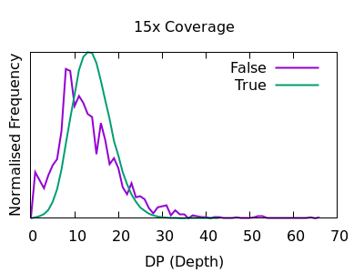
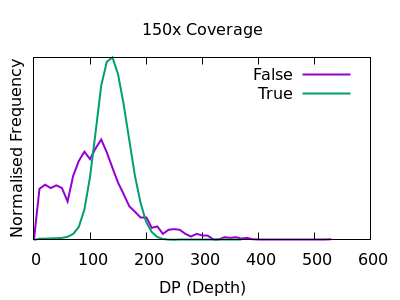

We see a sharp spike in depth for the true variants somewhere around
the expected average depth.  The false variants have a broader
distribution.  Looking at the deep data, it may appear that filtering
out variants in depth < 50 and depths > 250 would be an obvious win,
but note these plots have been normalised to have the same area so we
can clearly visualise them.  The disparity of sample sizes between
true and false variants is so large we don't really know how costly
that filtering may be.  If we don't normalise and instead plot using a
log scale then we see that even at the left (low) end there are more
true calls than false calls.


An alternative solution is to plot a log-odds plot, using log10(p/(1-p))
with p being the probability of this depth value being a correct call.
In this case positive values indicate how many more times likely
(logged) the event is true than false, and vice-versa for negative
values.  A small sample size correction has been applied and error
bars show the data at the right end is unreliable due to insufficient
data, but the overall picture is clear enough.

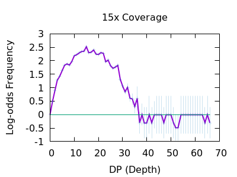
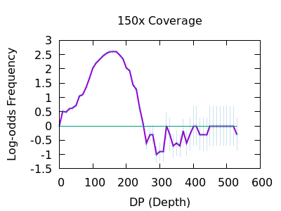

This now gives us a more useful way to visualise the suitable
filtering cutoffs, so we will use this style of plot from here on.

On the 15x figure it can be seen that true variants have a sharp peak,
in this case at around 14x coverage with very few true variants having
high depth.  In contrast the false variants have a long distribution
tail.  It is recommended to know the average depth and to filter at
somewhere around double that.  We observe here we would have a minimal
number of extra false negatives if we filted out `DP > 30`
(approximately 2 times the expected depth), but a considerable number
of false calls would be excluded.

At shallow data we may wish to filter at 2x average depth or slightly
higher (eg `DP > 35` on our 15x sample), while the deep data set it's
perhaps around 1.7x average depth (eg `DP > 250` on our 150x sample).


### Mapping Quality

In a heterozygous call with one allele matching the reference, the
distribution of mapping qualities for sequences matching REF versus
those matching ALT may differ due to reference bias.  This is to be
expected, however a large difference in these distributions may be
indicative of a false call.  We have a Mann-Whitney U test available
to compare these distributions.  These are normalised into a Z-score,
indicating the number of multiples of standard deviation above or
below the mean.  This is saved in the MQBZ INFO tag.

Normalised plots of these distributions can be seen here.

Note in bcftools 1.12 and earlier this is expressed as a probability
value, so filter rules will need to check against very small values,
such as `MQB < 1e-5`.

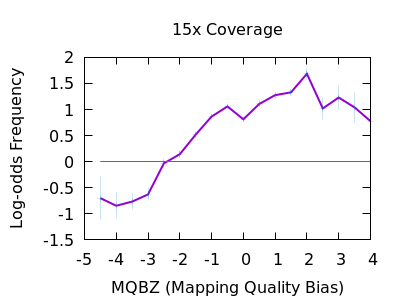
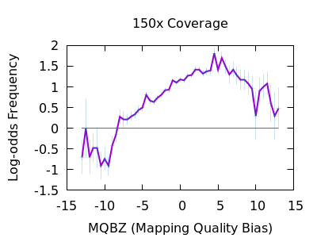

While there is a large overlap between the false and true
distributions, at both low and high depth there is a clear shifting
left for false variants.  Unfortunately the correct filtering offset
does also seem to be depth dependent. Filters of `MQBZ < -4` would be
appropriate for shallow data, and perhaps -9 for deep.

### Position

The position of a variant within the reads can matter.  We should
expect reads to be aligned fairly randomly, and thus variants to be
distributed randomly over the read.  Reference bias alignment
artifacts tend to be enriched for the ends of reads where a
substitution near the read end is usually preferable to an indel to
achieve optimal score (as alignments are pair-wise against the
reference rather than against the other sequences within in the
sample).

The RPBZ statistic is a Mann-Whitney U test represented as a Z-score
(the distance from the mean expressed in units of the standard
deviation) describing the difference in read position distributions
of REF and ALT calls.  As MQBZ this cannot be calculated for many
SNPS, but where possible it can help spot false calls due to reference
bias.

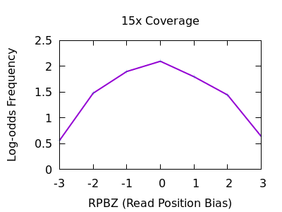
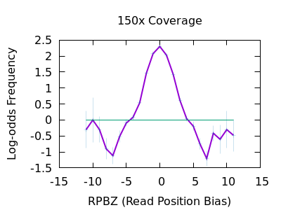

At shallow depth there isn't any discrimination power between false
and true variants.  It's more likely to be wrong at the extreme ends
of the distribution, but it's never more likely wrong than correct. At
deep data however the statistic becomes far more powerful.

The plots are largely symmetric so a filter of e.g. `RPBZ < -5 || RPBZ > +5` 
may work.

### Soft-clips

A multitude of sequence alignments having soft-clipped bases may be
indicative or a bad alignment, perhaps caused by reference bias
again.  The SCBZ is a Mann-Whitney U Z-score for the relative
distribution of length of soft-clip within the proximity of the
variant.

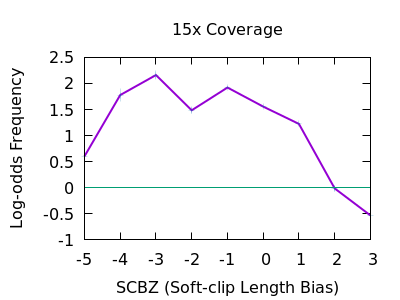
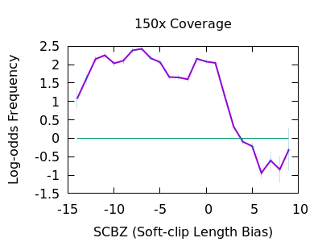

This test shows a sharp increase to the right end of the distribution
for false variants.  As with some other tests, the exact cutoff point
is dependent on the depth of the sample.

A filter of `SCBZ > 3` or `SCBZ > 4` would be appropriate for this data.


### Strand bias

This statistic is not enabled by default, but can be added with the
`-a FORMAT/SP` option of bcftools mpileup.

The plots below are normalises, and truncated in X.

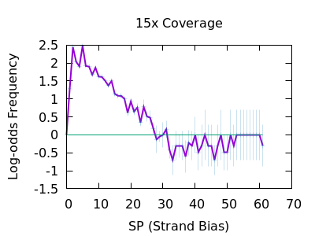
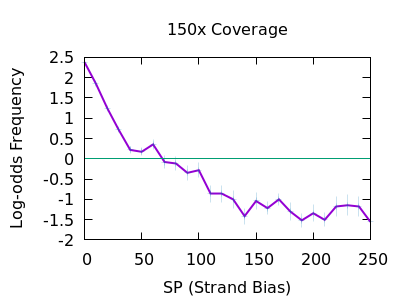

Both true and false variants have a sharp decay, but the tail is
considerably longer for false variants.  The test is still quite
powerful for shallow data too.

As with some other metrics, the threshold is very depth specific,
indicating `FORMAT/SP > 100` for the 150x data and `FORMAT/SP > 32` for
the 15x data.

### Putting it all together

While each test does not have a huge power to separate true from false
variants, some of the indicators may not be strongly correlated so
combining them together in a single clause can give a significant
boost.  If we are filtering out things that match our patterns, then
we should combine with logical OR.  For example the shallow data may use:

    bcftools view -e 'QUAL <= 10 || DP > 35 || MQBZ < -3 || RPBZ < -3 || RPBZ > 3 || FORMAT/SP > 32 || SCBZ > 3' in.vcf

with the deep data using:

    bcftools view -e 'QUAL <= 10 || DP > 250 || MQBZ < -3 || RPBZ < -3 || RPBZ > 3 || FORMAT/SP > 100 || SCBZ > 6' in.vcf

Note it's possible to construct some filtering rules that adjust these
thresholds according to the local depth of the data.  This is
challenging to optimise, but an example could be:

    bcftools view -e "QUAL < $qual || DP>2*$DP || MQBZ < -(3.5+4*DP/QUAL) || RPBZ > (3+3*DP/QUAL) || RPBZ < -(3+3*DP/QUAL) || FORMAT/SP > (40+DP/2) || SCBZ > (2.5+DP/30)"

Where `$qual` is the desired quality threshold and `$DP` is the
average sequencing depth.

Finally we can visualise the overall impact of our filtering by
plotting at different QUAL thresholds from 0 to 200 in increments of
10 and displaying false positives vs false negatives, with and without
the other filtering elements.  Obviously this needs a good quality
known truth set to be able to distinguish the variants.  Doing this we
see the combined power of the additional statistics.  The below figure
is for a 60x subsampling of GIAB HG002 chr1, showing SNP counts only.


The ideal position in this plot is the bottom left hand corner, with
as few false positives (high precision) and few false negatives (high
recall) as possible.  We see the green filtered plot mainly moves
leftwards, indicating a significant reduction in false positives with
a very marginal change in false negatives.


