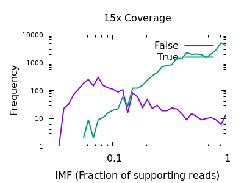
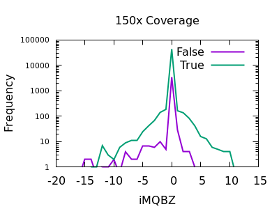

It is important to note this guide is covering filtering a single WGS
sample with an expectation of broadly even allele frequencies and
therefore any recommendations need to be taken cautiously.  The
techniques described however can be applied to any data set if you
have a suitable truth set.

Filtering in Bcftools is broadly broken down into two types: pre and
post-call filtering.

Pre-call filtering is where the application decides not to emit a
variant line to the VCF file.  Post-call filtering is where a variant
is emitted along with ancillary metrics, such as quality and depth,
which are then used for further filtering.

Where possible post-call filtering gives us the most flexibility as we
can adjust the filter rules and rapidly produce a revised call set
without rerunning a CPU expensive task.

However there are times where we know we may never wish to accept a
variant, such as specifying the minimum number of reads required to
call an insertion.  This sort of filtering is typically performed by
command line arguments in either `bcftools mpileup` or `bcftools call`
and are discussed below.

The post-call filtering is covered in more detail, split up into SNP
and InDel sections.

## Pre-call filtering

`bcftools mpileup` includes a number of options that govern when an indel
is permitted.  Some of these aren't strictly filters, but weights that
impact on when to call. The appropriate options are.

Option &nbsp;&nbsp;&nbsp;&nbsp;&nbsp;&nbsp;&nbsp;&nbsp;&nbsp;&nbsp;&nbsp;&nbsp;&nbsp;&nbsp;&nbsp;&nbsp;&nbsp;&nbsp;      | Description
----------- | -----------
-I          | Skips indel calling altogether
-L INT      | Maximum depth permitted to output an indel [250].<br>This can be filtered later using INFO/IDV so consider increasing this.
-m INT      | Minimum number of gapped reads for indel candidates [1].<br>The default is 2, but was 1 in earlier bcftools releases.<br>This can be filtered later using INFO/IDV.
-F FLOAT    | Minimum fraction of gapped reads [0.05].<br>This can be filtered later using INFO/IMF.
-h  INT     | A coefficient for the likelihood of variations in
homopolymer being genuine or sequencing artifact.  Lower indicates
more likely to be an error.  The default is now 500, but used to be 100.
--indel-bias FLOAT | A catch-all parameter to call more indels (higher
FLOAT) at the expense of precision, or fewer (lower FLOAT) but more
precise calls.  The default is 1.0.

Additionally `bcftools call` has some options which govern output of variants.

Option &nbsp;&nbsp;&nbsp;&nbsp;&nbsp;&nbsp;&nbsp;&nbsp;&nbsp;&nbsp;&nbsp;&nbsp;&nbsp;&nbsp;&nbsp;&nbsp;&nbsp;&nbsp;      | Description
----------- | -----------
-A          | Keep all possible alternate alleles at variant sites
-V TYPE     | Skip TYPE (indels or SNPs).

There are also options which tune both SNP and indel calling, but they
are various priors and scaling factors rather than hard filtering.
See the `mpileup` and `call` man pages for guidance.

## <a name="SNP"></a>SNP post-call filtering

Bcftools produces a number of parameters which may be useful for
filtering variant calls.  For SNPs the list of INFO fields are
plentiful.  We do not cover them all, but include DP, MQBZ, RPBZ,
and SCBZ below.  Additional filtering INFO and FORMAT fields can be
requested using the `mpileup -a` option and we also include
FORMAT/SP.  See the man page for full details of other filtering
fields.

The most obvious filter parameter however is the QUAL field.

Bcftools can filter-in or filter-out using options `-i` and `-e`
respectively on the `bcftools view` or `bcftools filter1 commands.  For
example:

    bcftools filter -O z -o filtered.vcf.gz -i '%QUAL>50' in.vcf.gz
    bcftools view -O z -o filtered.vcf.gz -e 'QUAL<=50' in.vcf.gz

The quality field is the most obvious filtering method.  This is one
of the primary columns in the VCF file and is filtered using `QUAL`.
However the INFO and FORMAT fields contain many other statistics which
may be useful in distinguish true from false variants, and this is
where more complex filtering rules come in.

It can be tricky to work out the impact of various filtering rules,
and paramters may need to be changed by depth or sequencing strategy,
both technology and WGS vs Exome.  Different filtering will be needed
for SNPs and indels too.

However one useful technique, if you have a truth set available, is to
use `bcftools isec` on a VCF call file and a VCF truth file.  This
will produce 4 files containing the variants only in file 1, only in
file 2, and the variants matching in both (with the records from file 1
and in file 2 respectively).  Combining this with bcftools query will
permit construction of histograms, indicating what filtering
thresholds are appropriate.

The following are examples produced from the GIAB HG002 Illumina data
set, aligned by Novoalign.

Firstly we need to ensure both truth set and call set are normalised
using the same tool.  For this `bcftools norm -m -both -f $ref` may be
used.  Additionally you may wish to use something like `vt
decompose_blocksub` to separate out multi-allelic calls if you wish to
count each allele call separately.  If you have a bed file listing
valid regions to include or exclude, make sure to filter to those
regions too.

After this, ensure both files are bgzipped and indexed before running
isec.

```
bcftools isec -c both -p isec truth.vcf.gz call.vcf.gz
```

Now outdir/0001.vcf contains variants only found in truth.vcf.gz and
hence are false negatives.  Outdir/0002.vcf contains only variants
only in the call set, and are false positives.  Outdir/0003.vcf and
outdir/0004.vcf are the true variants.

### VCF Call Quality

We may produce a histogram from outdir/0003.vcf (true) and
outdir/0001.vcf (false) to compare the distributions of the `DP`
(depth) field.  This may be either an INFO or a FORMAT field, but for
simplicitly we are restricting this guide to a single sample and using
INFO.

```
bcftools query -i 'TYPE="SNP"' -f '%QUAL\n' isec/0001.vcf > QUAL_1
bcftools query -i 'TYPE="SNP"' -f '%QUAL\n' isec/0003.vcf > QUAL_3
```

These files may be turned into histograms with a simple perl script or
whatever language you prefer:

```
perl -MPOSIX -lane '$h{POSIX::round($F[0]/10)}++; END {@k=sort {$a <=> $b} (keys %h);for ($i=@k[0]; $i <= @k[-1]; $i++) {print $i*10,"\t",$h{$i}+0}}' QUAL_1 > QUAL_1_hist
perl -MPOSIX -lane '$h{POSIX::round($F[0]/10)}++; END {@k=sort {$a <=> $b} (keys %h);for ($i=@k[0]; $i <= @k[-1]; $i++) {print $i*10,"\t",$h{$i}+0}}' QUAL_3 > QUAL_3_hist
```

(Note if you are also going to be selectively filtering for high
quality variants only, then you may wish to amend the "bcftools query"
command above to `-i 'TYPE="SNP" && QUAL >= 30'` to see how the
various metrics work in conjunction with quality filtering.)

Finally we can plot them in gnuplot, using a log scale as the
disparity in sample sizes is very significant and attempting to
normalise by total sample size may also mislead us.

```
$ gnuplot
gnuplot> set logscale y
gnuplot> plot \
    "QUAL_1_hist" with lines lw 2 title "False", \
    "QUAL_3_hist" with lines lw 2 title "True"
```


There are some strange spikes at very high values, but overall the
trend is as we'd hope with an enrichment for false calls at low
quality and for true calls at high quality.

At deep depths, we see a clear point of around 60 or below where calls
are more likely to be incorrect than correct, but there are still a
significant number of correct calls (log-odds of -0.5 equates to
around 30:70 split in true:false).

For shallow depths, all quality values still are still more likely
correct calls than incorrect.

Ultimately the threshold for filtering will depend on your application
and whether high recall (low false negatives) is more important than
high precision (low false positives).


### Depth

The sequencing depth may vary considerably across the sample.  If we
have a very sudden increase in depth, then it is possibly an
indication of misalignment or an additional repeat copy in this sample
vs the reference.  Such cases can lead to incorrect calls, which are
often extremely confident due to the high depth.


We see a sharp spike in depth for the true variants somewhere around
the expected average depth.  The false variants have a broader
distribution with long tails.

The filter value obviously depends on the average depth, but filtering
at some multiple of that can be powerful.  For example 2 times the
depth may be a reasonable starting point.  We see here that perhaps
`DP > 35` will work well on the shallow data and `DP > 250` for the
deep data.  These are not too far off doubling the depth (30 and 300).


### Mapping Quality

In a heterozygous call with one allele matching the reference, the
distribution of mapping qualities for sequences matching REF versus
those matching ALT may differ due to reference bias.  This is to be
expected, however a large difference in these distributions may be
indicative of a false call.  We have a Mann-Whitney U test available
to compare these distributions.  These are normalised into a Z-score,
indicating the number of multiples of standard deviation above or
below the mean.  This is saved in the MQBZ INFO tag.

Normalised plots of these distributions can be seen here.

Note in bcftools 1.12 and earlier this is expressed as a probability
value, so filter rules will need to check against very small values,
such as `MQB < 1e-5`.


While there is a large overlap between the false and true
distributions, at both low and high depth there is a clear shifting
left for false variants.  Unfortunately the correct filtering offset
does also seem to be depth dependent. Filters of `MQBZ < -4` would be
appropriate for shallow data, and perhaps -9 for deep.

### SNP Base Quality

Individual base qualities should have comparable distributions between
REF and ALT.  I bias here indicates the SNP may be a systematic error
caused by a specific sequence motif.

Note in bcftools 1.12 and earlier this is expressed as a probability
value, so filter rules will need to check against very small values,
such as `BQB < 1e-5`.


There is a slight skew towards lower BQBZ values for both low and high
depth, with a more noticable discrimination at depth.  The useful
threshold varies slightly by depth.

%-(3.1 + DP/40)

### Position

The position of a variant within the reads can matter.  We should
expect reads to be aligned fairly randomly, and thus variants to be
distributed randomly over the read.  Reference bias alignment
artifacts tend to be enriched for the ends of reads where a
substitution near the read end is usually preferable to an indel to
achieve optimal score (as alignments are pair-wise against the
reference rather than against the other sequences within in the
sample).

The RPBZ statistic is a Mann-Whitney U test represented as a Z-score
(the distance from the mean expressed in units of the standard
deviation) describing the difference in read position distributions
of REF and ALT calls.  As MQBZ this cannot be calculated for many
SNPS, but where possible it can help spot false calls due to reference
bias.


At shallow depth there isn't any discrimination power between false
and true variants.  It's more likely to be wrong at the extreme ends
of the distribution, but it's never more likely wrong than correct. At
deep data however the statistic becomes far more powerful.

The plots are largely symmetric so a filter of e.g. `RPBZ < -5 || RPBZ > +5` 
may work.

### Soft-clips

A multitude of sequence alignments having soft-clipped bases may be
indicative or a bad alignment, perhaps caused by reference bias
again.  The SCBZ is a Mann-Whitney U Z-score for the relative
distribution of length of soft-clip within the proximity of the
variant.


This test shows a sharp increase to the right end of the distribution
for false variants.  As with some other tests, the exact cutoff point
is dependent on the depth of the sample.

A filter of `SCBZ > 3` or `SCBZ > 4` would be appropriate for this data.


### Strand bias

This statistic is not enabled by default, but can be added with the
`-a FORMAT/SP` option of bcftools mpileup.

The plots below are normalises, and truncated in X.


Both true and false variants have a sharp decay, but the tail is
considerably longer for false variants.  The test is still quite
powerful for shallow data too.

As with some other metrics, the threshold is very depth specific,
indicating `FORMAT/SP > 100` for the 150x data and `FORMAT/SP > 32` for
the 15x data.

### Putting it all together

While each test does not have a huge power to separate true from false
variants, some of the indicators may not be strongly correlated so
combining them together in a single clause can give a significant
boost.  If we are filtering out things that match our patterns, then
we should combine with logical OR.  For example the shallow data may use:

    bcftools view -e 'QUAL <= 10 || DP > 35 || MQBZ < -3 || RPBZ < -3 || RPBZ > 3 || FORMAT/SP > 32 || SCBZ > 3' in.vcf

with the deep data using:

    bcftools view -e 'QUAL <= 10 || DP > 250 || MQBZ < -3 || RPBZ < -3 || RPBZ > 3 || FORMAT/SP > 100 || SCBZ > 6' in.vcf

Note it's possible to construct some filtering rules that adjust these
thresholds according to the local depth of the data.  This is
challenging to optimise, but an example could be:

    bcftools view -e "QUAL < $qual || DP>2*$DP || MQBZ < -(3.5+4*DP/QUAL) || RPBZ > (3+3*DP/QUAL) || RPBZ < -(3+3*DP/QUAL) || FORMAT/SP > (40+DP/2) || SCBZ > (2.5+DP/30)"

Where `$qual` is the desired quality threshold and `$DP` is the
average sequencing depth.

It's also worth noting that a lot of these tests filter the same
variants, so we may wish to pick a good discriminator, such as MQBZ,
and then filter on this prior to generating other plots such as RPBZ
and SCBZ.  Or we may wish to experiment with combinations such as
summing.  This article is not a complete tutorial, but aims to explain
the ways you can experiment with filtering your own files.

Finally we can visualise the overall impact of our filtering by
plotting at different QUAL thresholds from 0 to 200 in increments of
10 and displaying false positives vs false negatives, with and without
the other filtering elements.  Obviously this needs a good quality
known truth set to be able to distinguish the variants.  Doing this we
see the combined power of the additional statistics.  The below figure
is for a 60x subsampling of GIAB HG002 chr1, showing SNP counts only.


The ideal position in this plot is the bottom left hand corner, with
as few false positives (high precision) and few false negatives (high
recall) as possible.  We see the green filtered plot mainly moves
leftwards, indicating a significant reduction in false positives with
a very marginal change in false negatives.


## <a name="indel"></a>InDel post-call filtering

Insertions and deletions use different INFO and FORMAT fields to SNPs
and so need their own set of filter rules.

Applying similar strategies to above we can test the various INDEL
statistics available.

### Quality


Unfortunately the QUAL field really doesn't seem particularly
beneficial for indel filtering.  There is perhaps a slight change in
slope between true and false, meaning the cumulative numbers for
variants above a specific QUAL may change, but it isn't a particularly
powerful metric.

### Depth

As with SNPs, the total depth can be assessed via the INFO/DP field.


Unlike SNPs however the discrimination between true and false indels
is weak.  However the same depth filtering values of 35 and 250 (or 2x
average depth if you just want a guess at a starting point) look to
still apply.

### Number of reads confirming an insertion or deletion

This field is specific to indels: the INFO/IDV metric.


There is a very sharp drop in accuracy for low IDV values.  A single
read is quite unreliable, and a minimum of 2 would be recommended.
Note earlier bcftools releases had a default of 1 (it is now 2), but
this can also be adjusted with the `mpileup -m 2` option.

### Fraction of reads confirming an insertion or deletion

The INFO/IMF field is a fraction of the total reads matching an
indel.  This is a more useful metric than IDV for particularly deep
data sets.  It can also be controlled by the `mpileup -F FLOAT` option.




Note in this plot the X axis is also logarithmic, as the bulk of the
discrimination power is in the very low fractions.  For both data sets
however `IMF < 0.1` looks to be a suitable filter option.

### Read Position Bias


The RPBZ INFO field has an enrichment for false variants at above 6 or
7, although with shallow data this generally isn't reached.

### Soft-clip Bias


As for RPBZ, the SCBZ INFO field also has an enrichment for false
variants at high values, above 8 or so for deep data.

There is some overlap with RPBZ too, but summing the two fields
together before filtering works well.  For example `RPBZ + SCBZ > 9`.

### Mapping Quality Bias




This isn't as strong a selector as for SNPs, but the overall shape is
consistent with extreme low values being more likely to be false
calls. The cutoff point is very depth specific (as it is with SNPs).

### Putting it all together

On a file containing indels, we can combine the various filter options
together.  Which parameters you use will depend on depth, but an
attempt at a depth agnostic approach that works OK may be as follows:

    bcftools view -e "IDV < 2 || \
        IMF < 0.02+(($qual+1)/($qual+31))*(($qual+1)/($qual+31))/4 || \
        DP > ($DP/2) * (1.7 + 12/($qual+20)) || \
	MQBZ < -(5+DP/20) || RPBZ+SCBZ > 9" in.vcf

Note the `QUAL` column is completely absent in this filter rule as it
simply isn't robust enough (currently) for indel filtering.


Note if you're going to be filtering heavily, favouring precision over
recall, then you may wish to down-weight the initial likelihood of
indels being called using e.g. `--indel-bias 0.75`.  Conversely if
you want as high a recall as possible, at the cost of some precision
accuracy, boosting this with e.g. `--indel-bias 2.0` may help.  These
are calling parameters that may have a better outcome than simply
filtering.  (No filter can ever generate more calls.)


The above plot is showing false negatives (missing indels) vs false
positives (incorrect indel calls) on a low 15x depth data set with and

without indel filtering.  The effect is quite clear.  The initial
large jump from the first to second point comes primarily from needing
at least 2 sequences (`IDV<2`) to at least 3 (`IDV<3`).  The
unfiltered plot is just using `QUAL` as a filter rule, which does give
a slope trading FP and FN, but as discussed above is a rather poor
filter.  QUAL is unused in the filter plot.

## <a name="Combined"></a>Combined SNP and INDEL filtering

We now have one set of rules that work on SNPs and another that work
on INDELs.  We can either split our file up (e.g. `bcftools view -i
'TYPE="SNP"') into SNP-only and INDEL-only, or we can combine the
rules together.

This is possible, but it gets rather unwieldy.

The basic logic, assuming we are still using exclusion (filter-out)
rules, would be:

    bcftools view -e "(TYPE="SNP" && $snp_rule) || (TYPE="INDEL" && $indel_rule)" in.vcf

